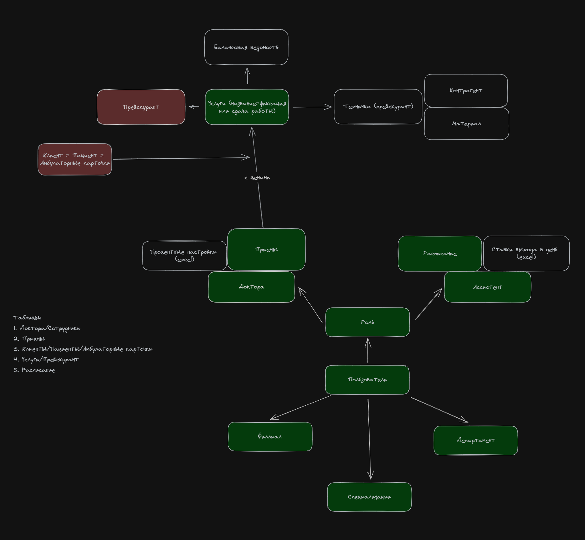

# Structure

## 1. Staff
### Entities
- Role
> The role defines the invariant of the Staff: doctor, assistant, etc.
- Users
  - Staff (abstract class)
  - Doctor 
  - Assistant
  - Technician (not an employee)
>   Each Staff can be presented in variants based on his role.  
>   The calculation method for each invariant is different

## 2. Treatments
### Entities
- Service
- Treatment
> Staff receive Salary in each Filial independently 
- Filial
- Department
> Staff have different interest rates (a.n.a. Salary-grid) depends on Department
- Consumables

## 3. Schedule
### Entities
- Schedule
> For Assistants and the like who receive a Salary depending on the number of working hours

## 4. Salary
### Entities
- Salary
  - Salary-grid

# Business Logic

# Requirements
- min python v. 3.11
- min Flask v. 2.*

# Run app
- pip install virtualenv
- virtualenv -p python3 venv
- venv\Scripts\activate.bat OR venv\Scripts\Activate.ps1
- pip install -r requirements.txt
- type nul > db/aestetica/db.sqlite3
- alembic upgrade head
- python db/sync.py
- python app.py